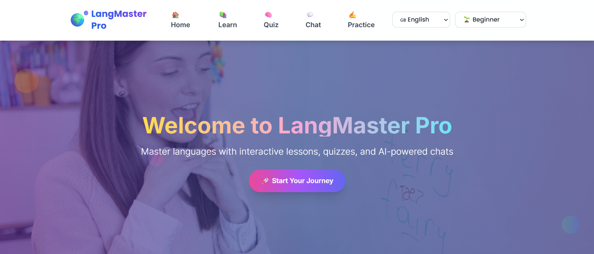
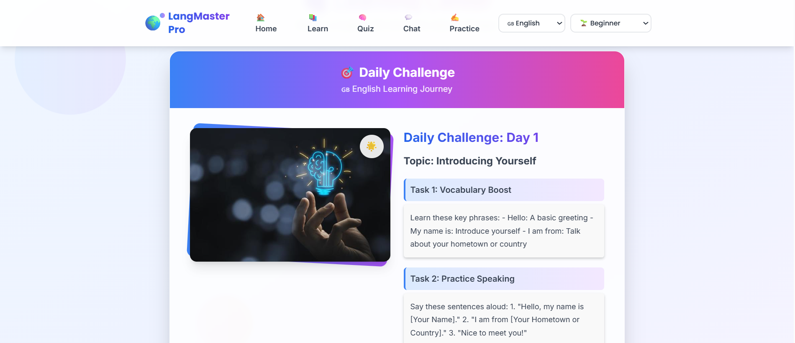
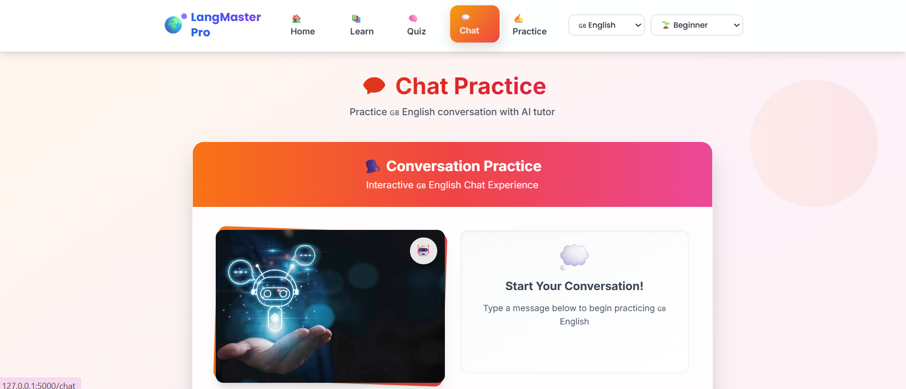
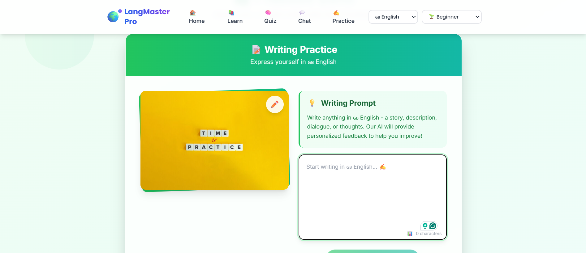

# LangMaster Pro

A comprehensive language learning application built with Flask, featuring AI-powered conversations, daily challenges, quizzes, and practice exercises.

## 🎯 Features Overview

### 🏠 Home Dashboard

*Interactive home page with testimonials and feature highlights*

- Overview of your learning journey
- User testimonials carousel
- Language and level selection
- Modern responsive design

### 📚 Learn Section

*Daily challenges and interactive learning modules*

- Daily AI-generated challenges for different languages
- Progressive difficulty levels
- Interactive learning modules
- Track your learning progress

### 🧠 Quiz Challenge

*Interactive quizzes to test your knowledge*

- AI-generated quiz questions
- Multiple choice format
- Instant feedback and explanations
- Adaptive difficulty based on your level

### 💬 Chat Practice

*AI-powered conversation practice*

- Real-time conversation with AI tutor
- Natural language processing
- Contextual responses
- Practice speaking and comprehension

### ✍️ Practice Zone

*Writing exercises with AI feedback*

- Writing practice exercises
- AI-powered feedback and corrections
- Grammar and vocabulary suggestions
- Improve your writing skills

## 🌍 Multi-language Support
- 🇬🇧 **English**: Complete learning modules
- 🇯🇵 **Japanese**: Hiragana, Katakana, and Kanji
- 🇩🇪 **German**: Grammar and vocabulary
- 🇫🇷 **French**: Conversation and writing

## 📱 Mobile Responsive Design
- Optimized for all devices (desktop, tablet, mobile)
- Touch-friendly interface
- Responsive navigation with mobile menu
- Fast loading and smooth animations

## 🛠️ Technologies Used

- **Backend**: Flask (Python web framework)
- **Frontend**: HTML5, CSS3, JavaScript, Tailwind CSS
- **AI Integration**: Groq API (LLaMA 3.3 70B model)
- **Styling**: Custom CSS with Tailwind CSS framework
- **Typography**: Poppins and Inter fonts
- **Deployment**: Vercel (serverless functions)
- **Session Management**: Flask sessions with secure cookies

## 📁 Project Structure

```
LangMaster-Pro/
├── main.py                 # Flask app for local development
├── api/
│   └── index.py           # Flask app for Vercel deployment
├── requirements.txt        # Python dependencies
├── vercel.json            # Vercel configuration
├── runtime.txt            # Python runtime version
├── Procfile               # Process file for deployment
├── .env.example           # Environment variables template
├── .gitignore             # Git ignore rules
├── DEPLOYMENT.md          # Deployment instructions
├── templates/             # HTML templates
│   ├── base.html         # Base template with navbar
│   ├── index.html        # Home page
│   ├── learn.html        # Learning page
│   ├── quiz.html         # Quiz page
│   ├── chat.html         # Chat page
│   └── practice.html     # Practice page
├── static/               # Static files
│   └── style.css        # Main stylesheet
└── image/               # Image assets and screenshots
    ├── home-readne.png   # Home page screenshot
    ├── learn-readme.png  # Learn page screenshot
    ├── quiz-readme.png   # Quiz page screenshot
    ├── chat-readme.png   # Chat page screenshot
    ├── practice-readme.png # Practice page screenshot
    └── [other images]
```

## ❓ Why Two Flask Apps?

### `main.py` - Local Development
- **Purpose**: Local testing and traditional hosting
- **Usage**: `python main.py`
- **File Paths**: Direct paths to templates and static files
- **Best For**: Development, debugging, traditional VPS hosting

### `api/index.py` - Vercel Deployment  
- **Purpose**: Serverless deployment on Vercel
- **Usage**: Automatic via Vercel
- **File Paths**: Relative paths (`../templates`, `../static`) 
- **Best For**: Production deployment, auto-scaling, global CDN

Both files contain the same application logic but are optimized for their respective environments.

## 🔄 Development vs Deployment

### 🚀 Quick Start

### For Local Development
```bash
# Clone the repository
git clone <your-repo-url>
cd LangMaster-Pro

# Install dependencies
pip install -r requirements.txt

# Set up environment variables
cp .env.example .env
# Edit .env file with your API keys

# Run locally
python main.py
```

### For Vercel Deployment
```bash
# Install Vercel CLI
npm install -g vercel

# Login and deploy
vercel login
vercel

# Set environment variables in Vercel Dashboard
# Then deploy to production
vercel --prod
```

## Local Development (`main.py`)
```bash
python main.py
# Runs on http://localhost:5000
```

### Vercel Deployment (`api/index.py`)
```bash
vercel
# Deploys as serverless function
```

**Key Differences:**
- **File Paths**: `api/index.py` uses relative paths (`../templates`, `../static`)
- **Structure**: Vercel requires files in `api/` folder for serverless functions
- **Purpose**: `main.py` for local testing, `api/index.py` for production
- **Tools**:
  - Git: Version control.
  - GitHub: Repository hosting.

## 🚀 Quick Start

### For Local Development
```bash
# Clone the repository
git clone <your-repo-url>
cd LangMaster-Pro

# Install dependencies
pip install -r requirements.txt

# Set up environment variables
cp .env.example .env
# Edit .env file with your API keys

# Run locally
python main.py
```

### For Vercel Deployment
```bash
# Install V
   # or source .venv/bin/activate  # macOS/Linux
   ```

3. **Install dependencies**:
   ```bash
   pip install flask
   ```

4. **Run the application**:
   ```bash
   python main.py
   ```

5. **Access the app**:
   - Open your browser and visit `http://localhost:5000/`.
   - Explore features: Home, Learn, Practice, Quiz, Chat.

### Folder Structure

```
LangMaster-Pro/
├── image/                  # Images and videos (favicon.png, video.mp4, etc.)
├── static/                 # Static files
│   └── style.css          # Custom CSS
├── templates/             # HTML templates
│   ├── base.html          # Base template with navbar (SVG globe, Poppins font)
│   ├── index.html         # Home page with video and footer
│   ├── learn.html         # Lessons page
│   ├── practice.html      # Practice exercises
│   ├── quiz.html          # Quizzes
│   └── chat.html          # AI chat interface
├── main.py                # Flask application
├── .gitignore             # Git ignore file (e.g., __pycache__, .venv)
└── README.md              # This file
```

## Contributing

Contributions are welcome! To contribute:

1. Fork the repository.
2. Create a new branch: `git checkout -b feature/your-feature`.
3. Make changes and commit: `git commit -m "Add your feature"`.
4. Push to your branch: `git push origin feature/your-feature`.
5. Open a Pull Request on GitHub.

Please ensure your code follows the project's style (e.g., Tailwind CSS for styling, Flask routes for backend).

## License

This project is licensed under the MIT License. See the [LICENSE](LICENSE) file for details.

## Deployment on Vercel

### Prerequisites
- Vercel account
- Groq API key

### Steps

1. **Install Vercel CLI**
   ```bash
   npm install -g vercel
   ```

2. **Login to Vercel**
   ```bash
   vercel login
   ```

3. **Deploy the project**
   ```bash
   vercel
   ```

4. **Set Environment Variables in Vercel Dashboard**
   - Go to your project in Vercel Dashboard
   - Navigate to Settings → Environment Variables
   - Add the following variables:
     ```
     GROQ_API_KEY=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
     SECRET_KEY=your-secret-key-here
     ```

5. **Redeploy**
   ```bash
   vercel --prod
   ```

### Alternative Deployment Method

1. **Connect GitHub Repository**
   - Push your code to GitHub
   - Import project from GitHub in Vercel Dashboard
   - Set environment variables as described above

## Environment Variables

| Variable | Description | Required |
|----------|-------------|----------|
| `GROQ_API_KEY` | API key for Groq AI services | Yes |
| `SECRET_KEY` | Flask secret key for sessions | Yes |

## API Integration

The application uses the Groq API for AI-powered features:

- **Model**: llama-3.3-70b-versatile
- **Features**: 
  - Daily challenge generation
  - Quiz question creation
  - Conversation practice
  - Writing feedback
  - Language translation and explanation

### API Key Security

- ✅ Environment variables are used for production
- ✅ Fallback hardcoded key for development (should be removed in production)
- ✅ Keys are excluded from version control via .gitignore
